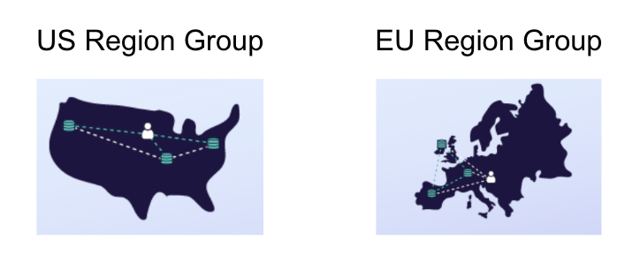

This repository contains unofficial patterns, sample code, or tools to help developers build more effectively with [Fauna][fauna]. All [Fauna Labs][fauna-labs] repositories are provided “as-is” and without support. By using this repository or its contents, you agree that this repository may never be officially supported and moved to the [Fauna organization][fauna-organization].

---

# Python Fly.io starter for Fauna

*[Fauna](https://fauna.com/) is a distributed relational database with a document data model. Delivered as an API, Fauna is automatically configured – out of the box – as a three replica database with active-active write capability, making it a powerful complement to [Fly.io](https://fly.io/) in serving low latency reads and writes for dynamic global applications.*

This starter kit provides a sample Fauna integration with Python and Flask, and configured to run on Fly.io

---

## Prerequisites
* Python 3.9 or greater
* [flyctl](https://fly.io/docs/hands-on/install-flyctl/)


## Create a Fauna database and generate an access key

* [Signup](https://dashboard.fauna.com/accounts/register) for a Fauna account if you don't have one already.
* Create a database and access key according to [these instructions](https://docs.fauna.com/fauna/current/learn/quick_start/client_quick_start?lang=javascript).
* Copy the `.env.example` file (in the root of this project) into a new file named `.env` and populate the variable FAUNA_SECRET_KEY with the access key from above. Leave FLASK_APP as-is:
  ```
  export FAUNA_SECRET_KEY="xxxxxxxx-xxxxxxxxx"
  export FLASK_APP="server"
  ```

## Test locally

```
python3 -m venv venv
```

Activate venv
```
source venv/bin/activate
```

Run Flask
```
flask run
```

Navigate to `http://127.0.0.1:5000/read`

This should perform a read from the Fauna database you created and populated with sample data, per the setup steps above.

## Deploy to Fly.io

To launch the app on fly, run `flyctl launch` in the root directory of this project.
You will be prompted for a few things:

* `? Would you like to copy its configuration to the new app? (y/N)` **Choose y (Yes)**
* `? Choose an app name (leaving blank will default to 'express-ts-fauna-starter')` **⚠️ Give it a new app name**
* Choose an organization
  (You would be defaulted to the "personal" organization if it is the only option)
* Would you like to set up a Postgresql database now? **Choose N (No)**
* Would you like to set up an Upstash Redis database now? **Choose N (No)**
* Would you like to deploy now? **Choose N (No)**

```bash
% flyctl launch
...
An existing fly.toml file was found for app python-fauna-starter
? Would you like to copy its configuration to the new app? Yes
Using build strategies '[a buildpack]'. Remove [build] from fly.toml to force a rescan
? Choose an app name (leaving blank will default to 'python-fauna-starter') <a-new-app-name>
automatically selected personal organization: 'your-personal-organization'
App will use 'sjc' region as primary

Created app '<a-new-app-name>' in organization 'personal'
Admin URL: https://fly.io/apps/<a-new-app-name>
Hostname: <a-new-app-name>.fly.dev
? Would you like to set up a Postgresql database now? No
? Would you like to set up an Upstash Redis database now? No
Wrote config file fly.toml
? Would you like to deploy now? No
...
```

Environment variables are not uploaded. Before deploying, you should set the Secrets value for FAUNA_SECRET_KEY: 
```
fly secrets set FAUNA_SECRET_KEY="<fauna secret key>"
```

Now you can deploy:
```
fly deploy
```

Once the application has been deployed, you can find out more about its deployment. 
```
fly status
```

Browse to your newly deployed application with the `fly open` command.
```
% flyctl open

Opening https://<a-new-app-name>.fly.dev
```


## Scale your deployment to match the Fauna footprint

When you create a database in Fauna, it is automatically configured – out of the box – as a three replica database with active-active write capability (For example, if you created a database in the "US Region Group", there will be 3 replicas of the database across the United States). Thus, a good way to take advantage of this architecture is to deploy on 3 Fly.io regions as well, as close as possible to the database replicas.



Currently, Fauna provides 2 choices of Regions Groups, US and EU. The table below lists the Fly regions that are closest to the Fauna replicas of each respective region group:

| Fauna Region Group | Deploy on Fly Regions |
|--------------------|-----------------------|
| EU                 | lhr, arn, fra         |
| US                 | sjc, ord, iad         |

Thus, if you created your database in the US region group, you can scale up your Fly app using this command:

```
fly regions set sjc ord iad
```

Followed by this command:

```
fly scale count 3 --max-per-region=1
```

This would scale up the app to have 3 VMs, each in one of the specified Fly.io regions. There is nothing else that needs to be updated in the code or Fauna configuration, because Fauna automatically routes requests to the closest replica based on latency and availability. 


[fauna]: https://www.fauna.com/
[fauna-labs]: https://github.com/fauna-labs
[fauna-organization]: https://github.com/fauna
